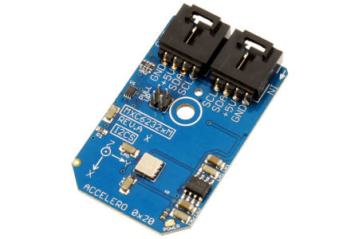

[](https://www.controleverything.com/content/Accelorometer?sku=MXC6232xM_I2CS)
# MXC6232xM
MXC6232xM Dual Axis Accelerometer 

The MXC6232xM device, provides fully integrated I2C thermal X, Y-Axis Accelerometer.

This Device is available from ControlEverything.com [SKU: MXC6232xM_I2CS]

https://www.controleverything.com/content/Accelorometer?sku=MXC6232xM_I2CS

This Sample code can be used with Raspberry pi.

##Java 
Download and install pi4j library on Raspberry pi. Steps to install pi4j are provided at:

http://pi4j.com/install.html

Download (or git pull) the code in pi.

Compile the java program.
```cpp
$> pi4j MXC6232xM.java
```

Run the java program as.
```cpp
$> pi4j MXC6232xM
```

##Python 
Download and install smbus library on Raspberry pi. Steps to install smbus are provided at:

https://pypi.python.org/pypi/smbus-cffi/0.5.1

Download (or git pull) the code in pi. Run the program

```cpp
$> python MXC6232xM.py
```

The code output is raw values of acceleration in X and Y Axis.

